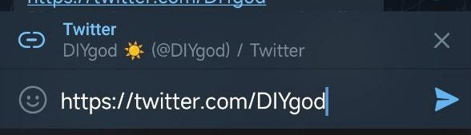
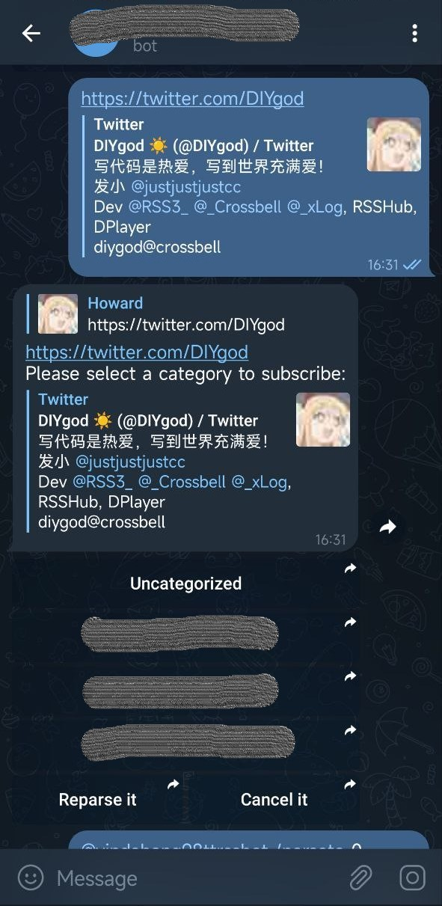
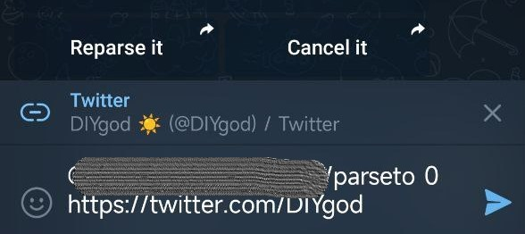

# RSSBot

RSSBot 是一个能帮你保存链接和订阅 RSSHub 的 Telegram Bot。

你是否对订阅源的质量要求很严格？
你是否会一次集中收集大量的订阅源？觉得RSSAid不适合大量收集订阅源的使用场景？
不想有乍看很好当场订阅过后细看却很烂的订阅源污染自己的数据库？
看到优质订阅源没空细看想找个地方暂存留待以后再确定要不要订阅？

这个小工具会保存你发送给它的所有链接，并辅助你在碎片时间完成订阅。
一次发一大堆的链接也是可以的哦。
不错过任何一个精彩的信息源，不放过任何一个垃圾的信息源。

## Use it

Run it

```sh
git clone https://github.com/yindaheng98/RSSBot
cd RSSBot
export VALID_USERNAME=<your username, RSSBot will only reply messages sent from this username>
export TELEGRAM_BOT_TOKEN=<your telegram bot token>
export RSS_DRIVER=ttrss
export RSS_HOST=<your ttrss host>
export RSS_USERNAME=<your ttrss username>
export RSS_PASSWORD=<your ttrss password>
npm run start
```

Send a URL to your RSSBot e.g. `https://twitter.com/DIYgod`:



The RSSBot will parse the URL and fetch the category list from your specified rss driver (e.g. `RSS_DRIVER=ttrss`).
Then you will receive a reply, and you can select a category:



Select a category and send the message (e.g. select the category "Uncategorized"):



The RSSBot will convert the URL to an RSSHub link and call the API (e.g. [TTRSS API](https://tt-rss.org/wiki/ApiReference)) to subscribe to the RSSHub link.

## Features: Save your URL

RSSBot has a sample database to store all the URLs you sent.
Only when RSSBot successfully subscribes to an RSSHub link, the related URL will be deleted from the database.

RSSBot will randomly select a stored URL and send it to remind you.
You can config the frequency with the environment variable `UNSUB_CHECK` and `UNSUB_CHECK_CRON`. See [`config.js`](config.js) for more detail.

## Config

All config variables are read from environments. See [`config.js`](config.js).

## Add custom functions

Install RSSBot as a package:

```sh
npm install rss-telegram-bot
```

Write your app:

```js
const { bot, rss, user } = require('rss-telegram-bot');

function getEHLink(tag) {
    let feeds = [];
    for (let url_format of config.eh_feed_formats) {
        feeds.push(util.format(url_format, encodeURIComponent(tag)));
    }
    return feeds
}

async function sendSubscribe(msg, category_id, tag) {
    const chatId = msg.chat.id;
    const msgId = msg.message_id;
    const category_title = await rss.getCategoryTitle(category_id);
    for (let feed_url of getEHLink(tag)) {
        logger.info(`Subscribing: ${feed_url}`);
        if (('' + category_id) === await rss.isSubscribed(feed_url)) {
            continue;
        }
        const { ok, err } = await rss.subscribeToFeed(category_id, feed_url);
        if (!ok) {
            const inline_keyboards = [[{
                text: 'Retry it',
                switch_inline_query_current_chat: `/subscribe_eh ${category_id} ${tag}`
            }]];
            bot.sendMessage(chatId, `Cannot subscribed to ${category_title}: ${err}`, {
                reply_to_message_id: msgId,
                reply_markup: {
                    inline_keyboard: inline_keyboards
                }
            });
            return;
        }
    }
    bot.sendMessage(chatId, `Subscribed to ${category_title}: ${tag}`, {
        reply_to_message_id: msgId
    });
}

bot.onQuery(/^\/subscribe_eh ([0-9]+) (artist:"[A-Za-z0-9 ]+\$")$/, async (msg, match) => {
    const category_id = parseInt(match[1]);
    const tag = match[2];
    sendSubscribe(msg, category_id, tag);
});
```

## API

```js
const { bot, rss, user } = require('rss-telegram-bot');
```

TBD
